# medicaments-ruptures-france-2013-2026 (Debut)
Analyse des événements de disponibilité des médicaments en France (2014–2026) – Power BI
# Analyse des tensions d’approvisionnement des médicaments en France (2014–2026)

## Contexte
Depuis 2017, la France connaît une augmentation des ruptures et tensions d’approvisionnement en médicaments.  
Ce projet analyse les données ouvertes de data.gouv.fr afin d’identifier les tendances, les médicaments et les laboratoires les plus impactés.

## Objectifs
- Analyser l’évolution des événements de disponibilité
- Identifier les types d’événements dominants
- Analyser les laboratoires les plus concernés
- Mettre en évidence les tendances temporelles

## Source des données
- data.gouv.fr – Données ouvertes sur la disponibilité des médicaments
- Période : 2014–2026
- Format : txt

## Outils utilisés
- Power BI
- Power Query
- DAX

## Analyses réalisées
- Évolution annuelle des ruptures et tensions
- Répartition par type d’événement
- Top 5 des laboratoires les plus impactés
- Analyse des remises à disposition et arrêts de commercialisation

## Aperçu du dashboard & analyses

### A)les laboratoires qui ont subi des évenements

### 1)Dashborad Synthètique

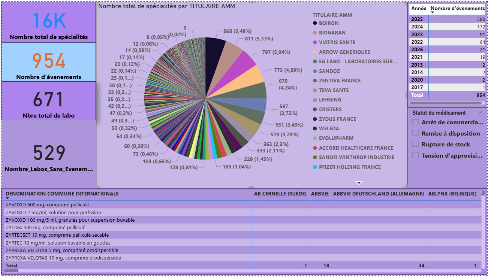

**Analyse :**
Sur une période de 2013 au début 2026, 953 événements ont été recensés, impliquant 142 laboratoires sur 671 (21,2%). L'année la plus agitée a été 2025, avec 580 événements. Les 5 laboratoitres ayant subi le plus d'événement sont ARROW (66), suivi de VIATRIS SANTE (64), EG LABO (58), BIOGARAN(54),TEVA SANTE(51) puis SANDOZ(45).

---

### 2) Répartition par type d’événement
### a) Rupture de stock
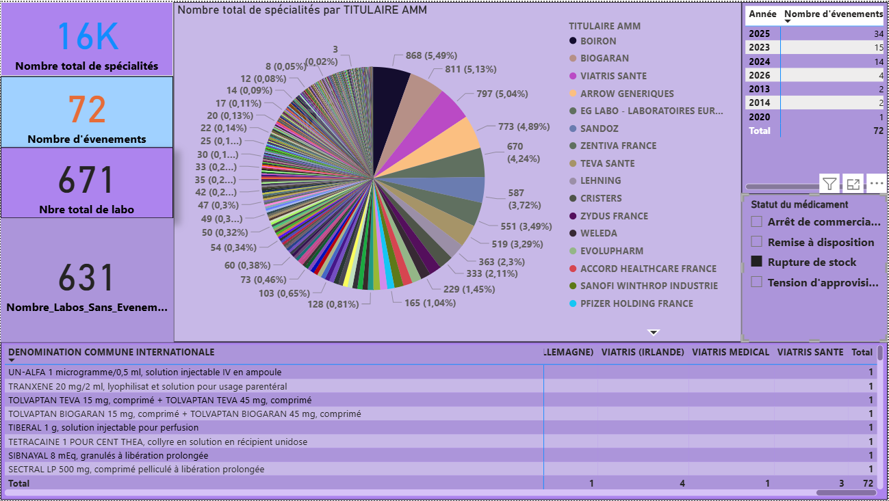

**Analyse :**
Les ruptures de stock représentent 7.5%(72) des événements sur une période de 2013 au début de 2026, avec un pic en 2025 où on a signalé jusqu'à 34 ruptures de stock, concernant au premier rang MYLAN (7), puis BIOGARAN (6),TEVA SANTE (5), VIATRIS IRLANDE (4) et LABO DELBERT (3) et 35 autres laboratoires. La rupture de stock observée chez MYLAN IRLANDE peut coïncider avec l'épuisement des médicaments de la marque, vu qu'elle est désormais connue sous le nom VIATRIS depuis 2020

### b) Tension d'approvissionnement
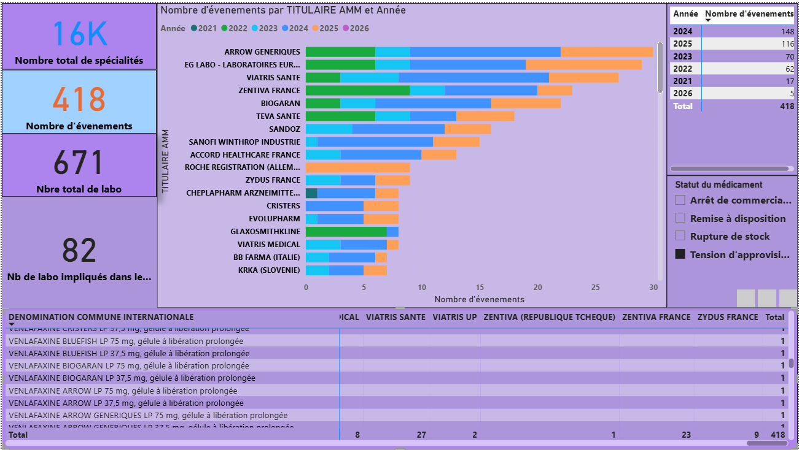

**Analyse :**
Les 418 tensions d’approvisionnement, touchant 82 laboratoires sur une période de 2021 à 2026 représentent 43.82% de tous les événements; avec un pic de 148 ruptures en 2024. le top 5 des laboratoires les plus touchés comprend ARROW (30), EG LABO (29), VIATRIS SANTE (27),ZENTIVA SANTE (23) et BIOGARAN (22)

### c) Remise à disposition 
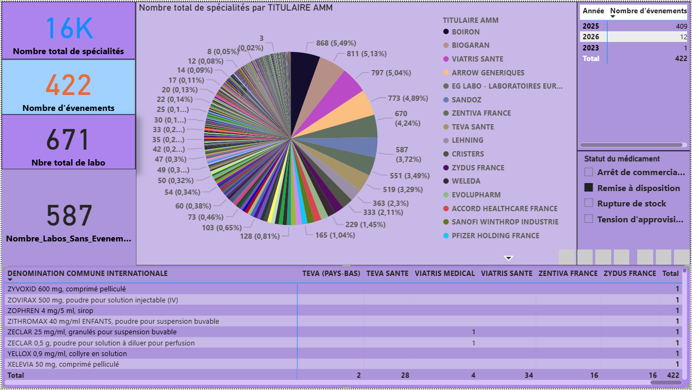

**AnalyLes:** 
Les 422 événements de remise à disposition représentent la majorité des événements c'est à dire 44.23%. Sur les 82 laboratoires qui en ont bénéficié etaient les laboratoires ARROW (35), VIATRIS (34), EG LABO, GLAXOSMITHKLINE, TEVA SANTE(28), SANDOZ (27) et BIOGARAN (21) constituent le top 5 des laboratoire dont les produits retournent à disposition des patients.

### d) Arrêt de commercialisation
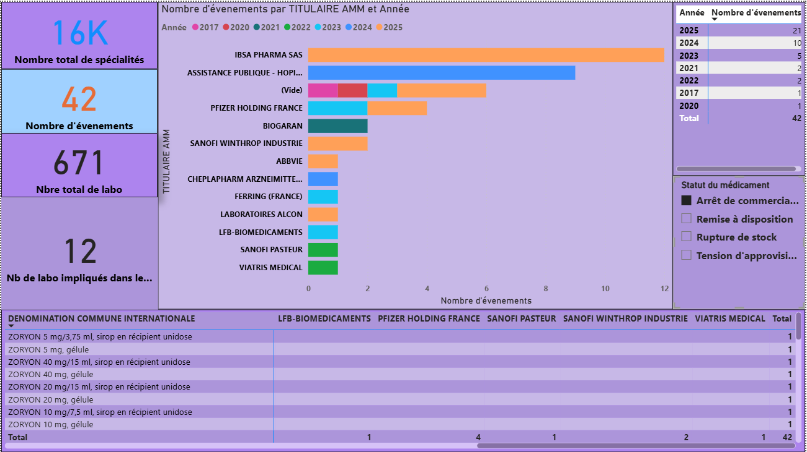

**Analyse :**
On a recensé 42 arrêts de commercilisation dans 12 laboratoires, ce qui représente 4,5% des événements avec un pic en 2025 (21). Les laboratoires principalement touchés sont IBSA PHAMA sur 12 spécialités, ASSISTANCE PUBLIQUE - HOPITAUX DE PARIS(9), PFIZER(4), BIOGARAN(2) et SANOFI WINTHROP (2)

### e) Evenements orphelins
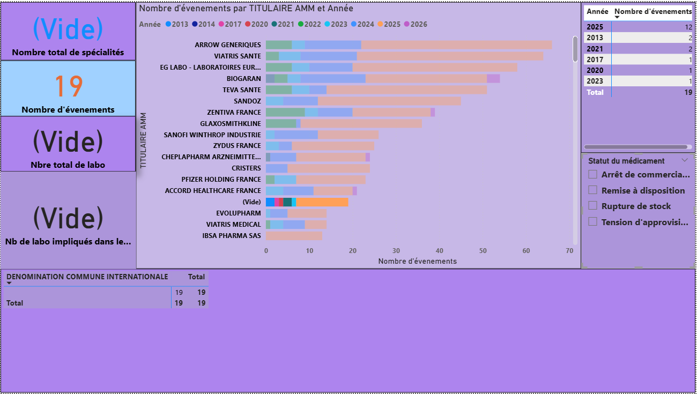

**Analyse :**
Un nombre limité d’événements (19) n’a pu être rattaché, ni à un titulaire, ni à une spécialité médicamenteuse du référentiel CIS utilisé. Ceci serait en raison d’évolutions du référentiel et de décalages temporels entre les sources, ou des valeurs manquantes. Ces événements ont été exclus de l’analyse principale.

**Conclusion partielle:**
### B)les laboratoires sans évenement
Le fait de ne pas avoir d'événement pouvant être perçu comme une situation de normalité, nous avons jugé utile d'approfondir l'etude en consultant également les évenements dr la table de dimension DIM INFO MEDICAMENTS à titre descriptif pour en tirer quelques éléments d'analyse
### Synthèse des Non_événements
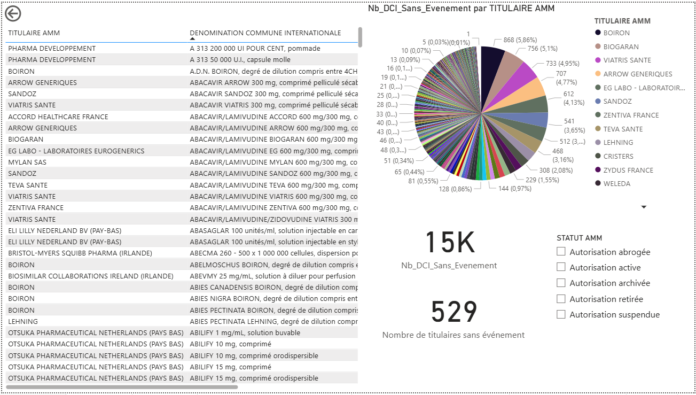

**Analyse :**
Sur une période allant de 2013 au début 2026, près de 15.000 spécialités (DCI) reparties entre 529 laboratoire n'ont subi aucun événement. Le laboratoire BOIRON, 868 DCI dispose du plus gros portefeuille représentant 5,86% de tous les médicaments normo-distribués. Il est suivi dans ce top 5 par les laboratoires BIOGARAN (765,5,1%), VIATRIS SANTE(733, 4,95%), ARROW GENERIQUES(707, 4,77%) et EG LABO (612, 4,13%)

### 1)Autorisation actives

## Analyse :
### Insight 1 — La stabilité est concentrée chez les grands génériqueurs
Sur plus de 15.000 spécialités, 14.000 stables sont repartis dans 501 laboratoires, soit 74,6% de tous les laboratoires de cette étude. 
Les laboratoires comme Biogaran, Viatris, Sandoz, Teva, Zentiva concentrent :un grand nombre de DCI, sans aucun événement déclaré. Cela suggère :une maîtrise industrielle et logistique, une robustesse des chaînes d’approvisionnement, une capacité à absorber la demande sans rupture

### Insight 2 — La majorité des DCI sans événement sont sous AMM active
Le filtre montre que la stabilité concerne surtout : des médicaments toujours commercialisés, donc réellement exposés au marché. L’absence d’événement n’est pas liée à l’inactivité réglementaire, mais à une vraie performance.

### Insight 3 — Un indicateur de “non-risque” exploitable
Cette analyse permet :
d’identifier les zones de faible risque, de servir de baseline pour comparer avec : DCI à risque élevé, titulaires plus instables

---
### 2)Suspension d'autorisation

**Analyse :**
Il y a aucours de la période d'étude 6 suspensions d'autorisation, touchant principalement 4 laboratoires principalement EG LABO, ZENTIVA, PFIZER
Ce faible pourcentage de suspension d'autorisation suggère une bonne maitrise des événements aucours du cycle de vie d'un médicament: etudes de stabilité, pharmacovigilance et la maitrise des affaires réglementaires

---
### 3)Retraits d'autorisation
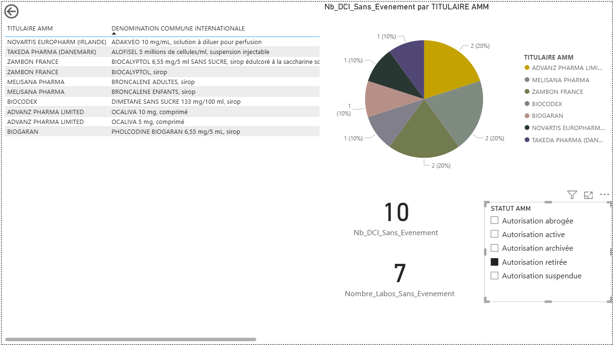

**Analyse :**
7 Laboratoires ont vu leur autorisation retirée, les laboratoires majoritairement touchés sont ADVANZ PHARMA, MELISANA PHARMA et ZANBON FRANCE.
Ce chiffre conforte l'analyse portée sur les suspension d'autorisation des laboratoire: Une maîtrise du cycle de vie du médicament et des événements y liés

---
### 4)Archivage d'autorisation
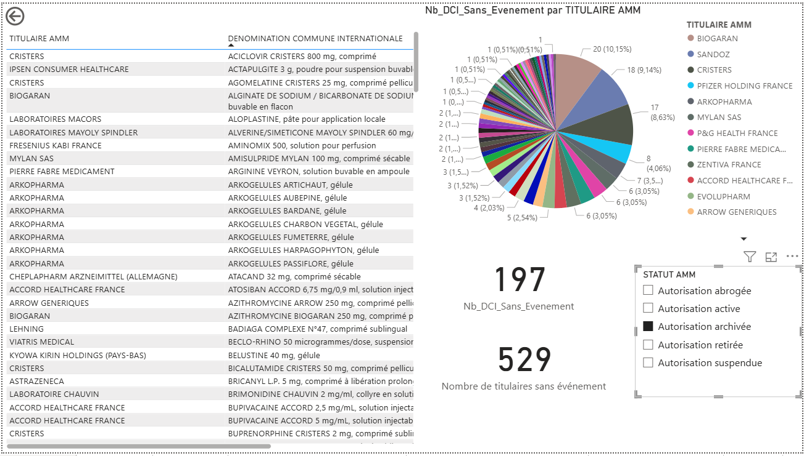

**Analyse :**
Ce dashboard présente les DCI n’ayant jamais fait l’objet d’un événement, associées à des AMM archivées, réparties par titulaire AMM

**Indicateurs clés** :
197 DCI sans événement, 70 laboratoires concernés, une répartition beaucoup plus fragmentée que pour les AMM actives

### Insights clés
### Insight 1 — Une stabilité résiduelle et dispersée
Contrairement aux AMM actives, aucun laboratoire ne concentre une part dominante, la majorité des titulaires ne possèdent que 1 à 3 DCI sans événement
👉 Cela reflète une stabilité résiduelle, liée à l’historique plutôt qu’à une stratégie active.

### Insight 2 — Différence structurelle avec les AMM actives
Les volumes sont nettement plus faibles (197 vs 14 000),Le nombre de laboratoires est aussi réduit (70 vs 501)
👉 Les AMM archivées jouent un rôle marginal dans la disponibilité actuelle du marché.

### Insight 3 — Faible enjeu opérationnel immédiat
Ces DCI ne sont plus activement commercialisées, n’impactent pas directement la continuité des soins. Elles doivent être exclues ou pondérées dans les modèles prédictifs.

### Limites et précautions méthodologiques
Les DCI associées à des AMM archivées présentent un faible intérêt prédictif en matière de rupture, leur statut limitant leur exposition réelle au marché.

---

### 5)Abrogation d'autorisation
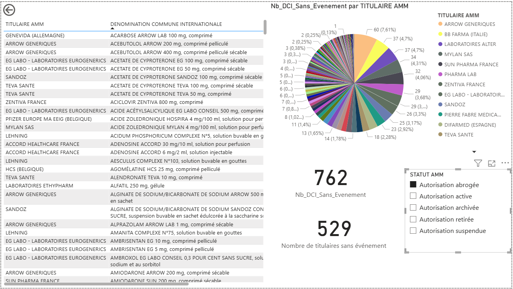

**Analyse :**
Ce dashboard présente les DCI n’ayant jamais fait l’objet d’un événement et associées à des autorisations de mise sur le marché abrogées, réparties par titulaire AMM.
## Indicateurs clés : ##
762 DCI sans événement, 134 laboratoires concernés. Une répartition hétérogène, avec une faible concentration par titulaire

### Insights clés
### Insight 1 — Un volume intermédiaire mais sans enjeu opérationnel actuel
Comparé aux autres statuts bien inférieur aux AMM actives, supérieur aux AMM archivées
👉 Cela reflète un historique réglementaire, plus qu’une performance actuelle.

### Insight 2 — Dispersion marquée des titulaires
Aucun laboratoire ne domine fortement, les parts individuelles restent faibles, beaucoup de titulaires n’ont que quelques DCI sans événement
👉 Contrairement aux AMM actives, il n’existe pas ici de leaders de stabilité.

### Insight 3 — Faible valeur prédictive
Les AMM abrogées ne sont plus exposées au marché, ne contribuent pas à la continuité des soins
👉 Leur inclusion dans un modèle prédictif biaiserait l’analyse.

---
### Prédiction
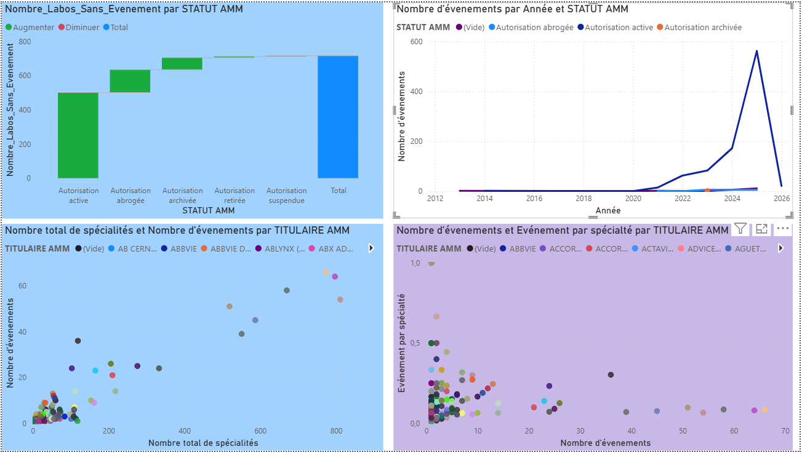

**Analyse :**
🔎 Lecture globale du dashboard

Ce tableau de bord analyse les événements de disponibilité des médicaments en France (ruptures, arrêts, tensions…) selon le statut AMM, le temps et les laboratoires titulaires, avec une approche à la fois descriptive et prédictive.

1️⃣ Nombre de laboratoires sans événement par statut AMM (graphique en cascade – en haut à gauche)
Ce que l’on observe
- La majorité des laboratoires sans événement concernent des médicaments à autorisation active.
- Les statuts abrogée, archivée, retirée ou suspendue contribuent marginalement.
- Le total montre qu’un volume important de titulaires n’a jamais déclaré d’événement.

### Interprétation métier
Les médicaments encore actifs sont globalement bien maîtrisés.
Les statuts non actifs concentrent peu de laboratoires → soit parce qu’ils sont peu nombreux, soit parce qu’ils ne génèrent plus d’événements.

### Insight clé
L’absence d’événements est fortement corrélée à un statut AMM actif, ce qui suggère une meilleure stabilité réglementaire et logistique.

2️⃣ Nombre d’événements par année et statut AMM (courbe – en haut à droite)
L'on peut voir:
- Une quasi-absence d’événements avant 2020.
- Une forte hausse à partir de 2021, avec un pic très marqué en 2024–2025, principalement sur les autorisations actives.
- Une chute brutale en 2026 (car année en cours donc incomplète).

### Interprétation métier
Effet post-crise (COVID, tensions logistiques, matières premières, dépendance aux API).
Les médicaments actifs sont les plus exposés, car ils sont les plus consommés.

### Insight clé
Le risque de rupture est devenu structurel et récent, concentré sur les AMM actives, ce qui justifie une approche prédictive plutôt que seulement descriptive.

3️⃣ Nombre total de spécialités vs nombre d’événements par titulaire AMM (nuage de points – en bas à gauche)
Ce que l’on observe

Corrélation positive : plus un laboratoire a de spécialités, plus il a d’événements.
Mais la relation n’est pas parfaitement linéaire : certains labos avec peu de spécialités ont beaucoup d’événements; d’autres très gros portefeuilles restent relativement stables

### Interprétation métier
La taille du portefeuille à lui seul n’explique pas tout. Des facteurs internes (organisation, sites de production, dépendance fournisseurs) joueraient un rôle.

### Insight clé
Le risque d’événement dépend à la fois du volume de spécialités et de la qualité de la chaîne d’approvisionnement du laboratoire.

4️⃣ Nombre d’événements vs événements par spécialité (nuage de points – en bas à droite)
L’on observe une forte concentration des points en bas à gauche : peu d’événements, donc faible taux d’événements par spécialité.
Quelques outliers avec beaucoup d’événements, mais un ratio événement/spécialité parfois faible

### Interprétation métier
Les gros laboratoires absorbent mieux les événements (effet dilution du au large portefeuille).
Les petits portefeuilles avec plusieurs événements sont à haut risque.

### Insight clé
Le ratio événement/spécialité est un meilleur indicateur de risque que le nombre brut d’événements.

5️⃣ Commentaire prédictif 

Ces visualisations justifient l’utilisation d’un modèle de loi de Poisson, car :
les événements sont discrets
rares
indépendants
observés sur une période donnée

Il etait ensuite judicieux de :
la probabilité d’au moins une rupture par DCI ou laboratoire
le nombre attendu d’événements à 3 ou 6 mois
identifier les DCI à risque élevé

---
## 🔍 Principaux insights
- Augmentation significative des tensions après 2020
- Concentration des événements chez certains laboratoires
- Les remises à disposition 

## 🚀 Améliorations possibles
- Modèle de prévision des tensions
- Croisement avec données ANSM
- Classification par classe thérapeutique

## 👤 Auteur
Georgy Djounda – Data Analyst / Pharmacien
